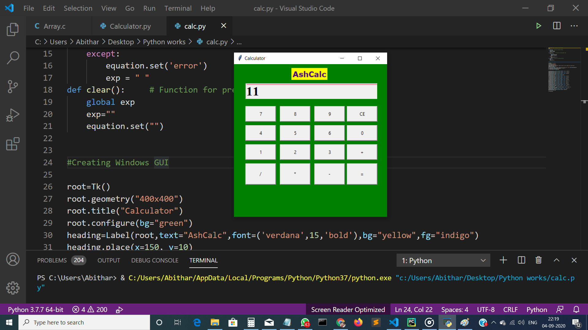
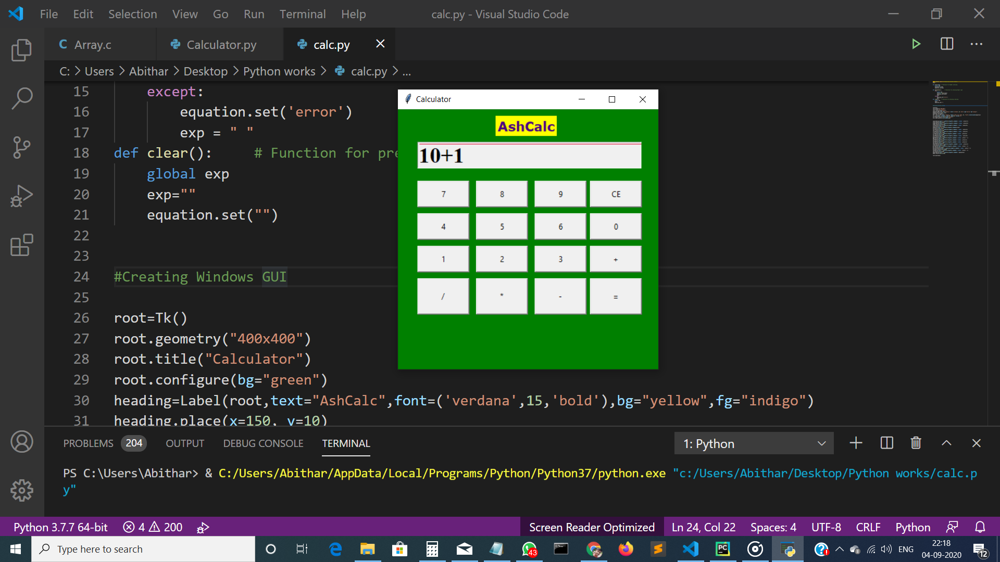

# AshCalc-SimpleCalculator 📱
A Python based simple calculator having basic arithmetic operations. 

## Tech Stacks
- Python3
- Library - Tkinter

## Image Results 📷

   

## Installation 
1. Clone the repository 
```
https://github.com/Ash515/AshCalc-SimpleCalculator.git
```
2. Check the status of your file 
```
$git status
```

3.For using VScode for editing your files 
```
$git code .
```
4. To directly add your files to github
```
$git add .
```
5. After writing your code commit your changes 
```
$git commit -m  <message>
```
6. To pull your code to reposoitory
```
$git push origin master
```
Thats all about installation and version control with **Git**

# Developers ❤
[Ashwin Kumar Ramaswamy](https://github.com/Ash515)
